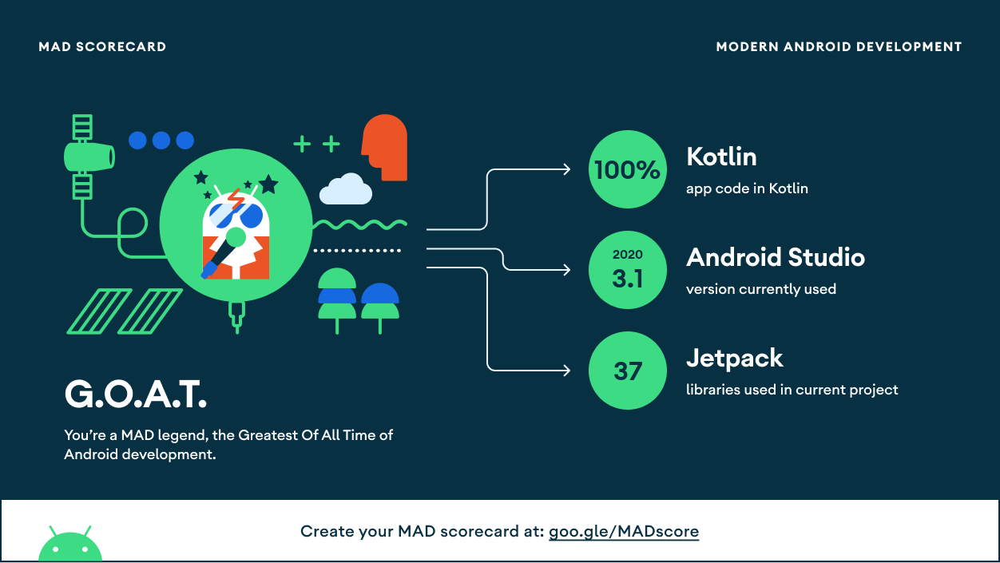
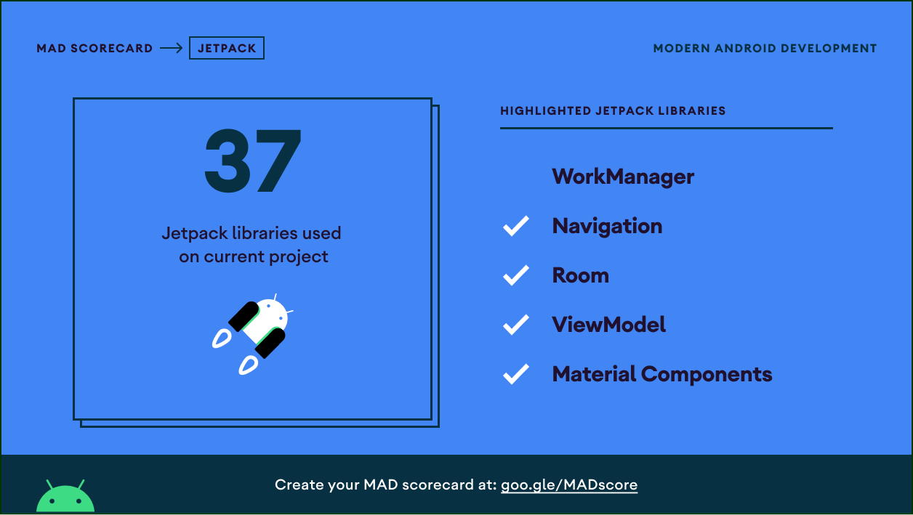
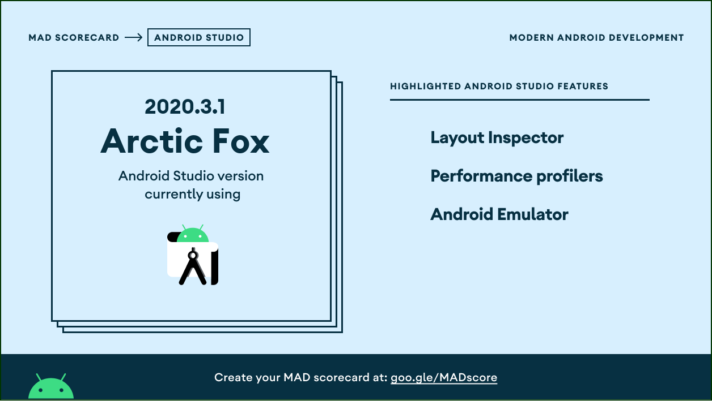

# Mobile Bank Applicatioin
#### This is a task, to develop a digital bank application that can be used by customers.

This application has the following screens:

1. launch screen
2. welcome screen
3. login screen
4. home screen
5. transfer screen

#### MAD SCORE
------------
Below is the MAD Score for this project

#### Launch Screen
------------
The Launch screen is shown, when the app is doing initial setup and initializations. In this case, it will show for a seconds.
It checks if the user is first-time visiting the application or already visited. If it is first time, then we will show the Welcome screen.

#### Welcome Screen
------------
The Welcome screen is shown for the first time to user to introduce the new features and the products.

  
#### Login Screen
------------
The Login screen, is useful to enter the application with username and password. Here the valid-mock username is **ocbc** and password is **123456**. Other values are invalid.

The login button will be enabled only if,
- User name must be greater than 3 digits
- password must be greater than 3 digits

 

#### Home Screen
------------
The Home screen display the accounts balance and the transactions list.

It also features, **refresh** and **logout** actions.

The user can either do **swipe to refresh** or click on the **refresh** button.

The **make a transfer** button will navigate to the transfer screen

#### Transfer Screen
------------
This is the screen where the user can send money to payees.

1. click on the payees text field will open a Modal Dialog to select from the list of payees.
2. click on the date field to select the date for transfer
3. Enter you comments for this transactiion
4. Enter the amount you want to send

Only after the user enters values for these fields, the transfer button will be enabled.

**When you make a transfer, the result is shown in a dialog.**

## If the transaction is success, then the repository data is invalidated, so when you go back to the HomeScreen, it wil refresh the account balance again.

You can also swipe to refresh from the home screen
